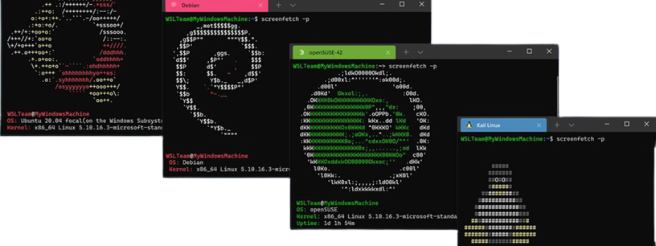

<!-- LOGO DIREITO -->
<a href="#um-pouco-mais-sobre-o-wsl"></a>

# Um pouco mais sobre o WSL

<p align="left">
  <a href="https://github.com/JonathanTSilva/HL-Windows">
    
  </a>
</p>

💻 Aprenda todos os conceitos e práticas que envolvem o Subsistema Windows para Linux.

<!-- SUMÁRIO -->
- [Um pouco mais sobre o WSL](#um-pouco-mais-sobre-o-wsl)
  - [1. Introdução](#1-introdução)
  - [Rede](#rede)

<!-- VOLTAR AO ÍNICIO -->
<a href="#"></a>

## 1. Introdução

## Rede

Quando utilizamos alguma distribuição do WSL 1, se o seu computar estiver configurado para ser acessado pela sua LAN, as aplicações que rodar no WSL 1, poderão ser acessadas pela suas rede LAN também.

Isso não é um caso padrão no WSL 2, que tem um adaptador virtual de ethernet com o seu próprio endereço de IP único. Atualmente, para habilitar este fluxo de trabalho é preciso percorrer pelos mesmos passos como se fosse uma máquina virtual regular.

Já para o IPV6, atualmente, as distribuições WSL 2 não podem alcançar endereços IPV6-only.

![wslNet01][wslNet01]

A única maneira de acessar o WSL pela sua rede, é habilitando alguns recursos necessários, para que a máquina seja vista como outras (pelo **Remote Desktop Connection** do Windows, por exemplo). Para isso, é preciso adicionar um tunelamento para as portas requeridas do WSL. Aqui está um exemplo de comando no PowerShell para adicionar no proxy uma porta que escuta a porta `4000` do host e conecta a porta `4000` da máquina virtal do WSL 2 com o IP `192.168.101.100`.

```powershell
netsh interface portproxy add v4tov4 listenport=4000 listenaddress=0.0.0.0 connectport=4000 connectaddress=192.168.101.100
```

Agora, a estação host conseguirá tunelar a conexão (*proxing*) externa para a rede do WSL 2 (especificamente a porta aberta: 4000). Entretanto, ainda é preciso criar uma regra para essa porta no firewall, para que seja permitido esse tráfego. Para maiores informações, verifique o seguinte *issue* no GitHub: [[WSL 2] NIC Bridge mode 🖧 (Has TCP Workaround🔨) #4150][3]. Há um script automático para realizar tal modificação:

1. **Windows Firewall** > **Advanced Settings**;
2. Clique em **Inbound Rules** > **New Rule**...
3. Na janela que abrir, selecione **Port** e clique em **Next**;
4. Selecione o protocolo da porta, e em **Specific local ports**, digite a porta a ser liberada;
5. Posteriormente, **Allow the connection**;
6. Deixe selecionado as seguintes três opções: **Domain**, **Private** e **Public**, e clique em **Next**.
7. Preencha com o Nome da nova regra e a descrição para então finalizar clicando em **Finish**.

```shell
$remoteport = bash.exe -c "ip addr | grep -Ee 'inet.*eth0'"
$found = $remoteport -match '\d{1,3}\.\d{1,3}\.\d{1,3}\.\d{1,3}';

if( $found ){
  $remoteport = $matches[0];
} else{
  echo "The Script Exited, the ip address of WSL 2 cannot be found";
  exit;
}

#[Ports]

#All the ports you want to forward separated by coma
$ports=@(80,443,10000,3000,5000);


#[Static ip]
#You can change the addr to your ip config to listen to a specific address
$addr='0.0.0.0';
$ports_a = $ports -join ",";


#Remove Firewall Exception Rules
iex "Remove-NetFireWallRule -DisplayName 'WSL 2 Firewall Unlock' ";

#adding Exception Rules for inbound and outbound Rules
iex "New-NetFireWallRule -DisplayName 'WSL 2 Firewall Unlock' -Direction Outbound -LocalPort $ports_a -Action Allow -Protocol TCP";
iex "New-NetFireWallRule -DisplayName 'WSL 2 Firewall Unlock' -Direction Inbound -LocalPort $ports_a -Action Allow -Protocol TCP";

for( $i = 0; $i -lt $ports.length; $i++ ){
  $port = $ports[$i];
  iex "netsh interface portproxy delete v4tov4 listenport=$port listenaddress=$addr";
  iex "netsh interface portproxy add v4tov4 listenport=$port listenaddress=$addr connectport=$port connectaddress=$remoteport";
}
```

>**Nota:** há a possibilidade de instalar uma interface gráfica para as distribuições do WSL 2, com a aplicação . Para mais informações, leia [esse post][1] e [essa discussão no GitHub][2].

<!-- MARKDOWN LINKS -->
<!-- SITES -->
[1]: https://medium.com/@japheth.yates/the-complete-wsl2-gui-setup-2582828f4577
[2]: https://github.com/microsoft/WSL/issues/4619
[3]: https://github.com/microsoft/WSL/issues/4150

<!-- IMAGES -->
[wslNet01]: ../../Images/wsl-net01.png
