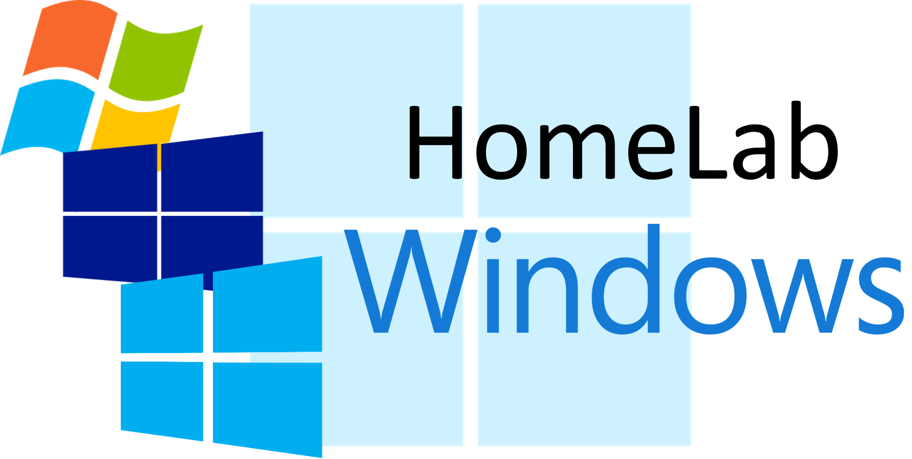

<!-- PROJECT LOGO -->
<h1 align="center">
   
  
   
  HomeLab - Windows
   
</h1>

<h4 align="center">
  
🛠 Passo a passo que adoto na minha utilização do Windows.
  
</h4>

<!-- PROJECT SHIELDS -->

  
  
  
  
  

<!-- TABLE OF CONTENTS -->

  
<b>Sumário</b>

          <a href="#sobre-o-projeto">Sobre o Projeto</a> |
          <a href="#primeiros-passos">Primeiros Passos</a> |
          <a href="#guia-rápido">Guia Rápido</a> |
          <a href="#contribuindo">Contribuindo</a> |
          <a href="#licença">Licença</a> |
          <a href="#contato">Contato</a>

## Sobre o Projeto

## Índice

## Contribuindo

Se você quer contribuir com este projeto e aprimorá-lo, sua ajuda é sempre bem vinda!

**Como fazer um _pull request_ corretamente:**

- Criar um _fork_ pessoal do projeto no GitHub;
- Clonar o _fork_ em sua máquina local. Seu repositório remoto do GitHub é conhecido por `origin`;
- Adicionar o repositório original como um remoto chamado `upstream`;
- Se você criou o _fork_ há algum tempo, certifique-se de realizar pull das alterações no seu repositório local;
- Criar um nova _branch_ para trabalhar nela! Ramifique da `develop`, se existir; caso contrário, crie da `main`;
- Implementar/corrigir sua _feature_, não esquecendo de comentar o seu código;
- Siga o estilo de código do projeto em questão, inclusive a identação;
- Se o projeto apresentar testes, execute-os;
- Escreva ou adapte os testes, conforme necessário;
- Adicionar ou alterar a documentação, conforme necessário;
- Junte seus _commits_ em um único _commit_ com o [rebase interativo](https://www.atlassian.com/br/git/tutorials/rewriting-history/git-rebase) do Git. Criar uma nova _branch_, caso seja necessário;
- _Push_ sua _branch_ para seu _fork_ do GitHub, o remoto `origin`;
- Do seu _fork_, abra uma _pull request_ na _branch_ correta. Aponte a _branch_ `develop` do projeto se existir; caso contrário, vá para `main`;
- Uma vez que o _pull request_ for aprovado e mesclado, é possível extrair as alterações do `upstream` para seu repositório local e exluir suas _branchs_ extras;
- Pronto! Muito obrigado pela contribuição.

> Sempre escreva suas mensagens de commit no tempo presente. Sua mensagem de commit deve descrever o que o commit, quando aplicado, faz com o código – não o que você fez com o código.

<!-- MIT License -->

## Licença

Distribuída por **MIT License**. Veja [LICENSE](https://github.com/JonathanTSilva/HL-Windows/blob/main/LICENSE) para mais informações.

## Contato
:globe_with_meridians: [Jonathan T. da Silva](https://www.linkedin.com/in/JonathanTSilva/)  
:email: jonathantobias2009@hotmail.com  
:package: [JonathanTSilva/HL-Windows](https://github.com/JonathanTSilva/HL-Windows)

<!-- MARKDOWN LINKS>
<!-- SITES -->

<!-- IMAGES -->

